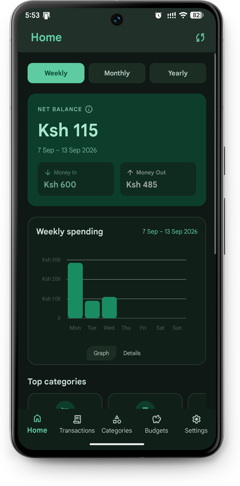
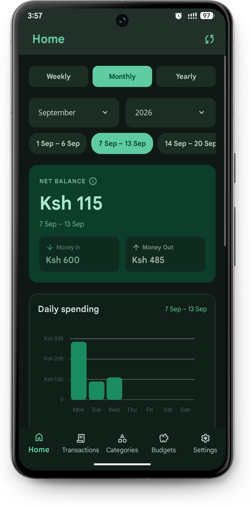
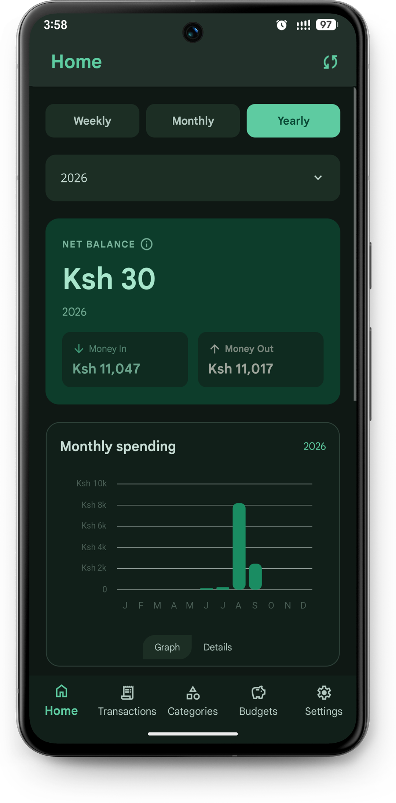
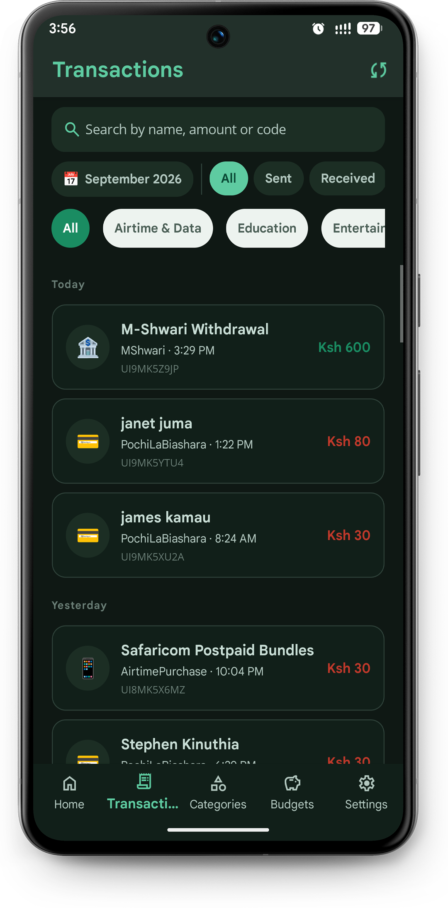
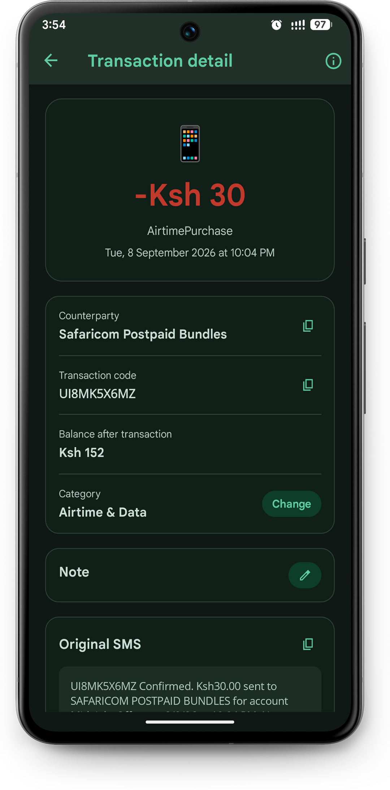
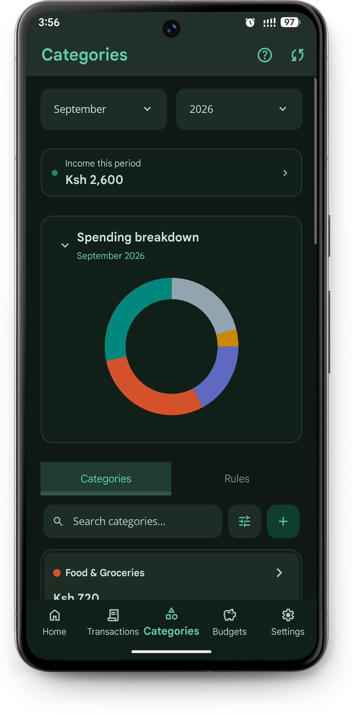
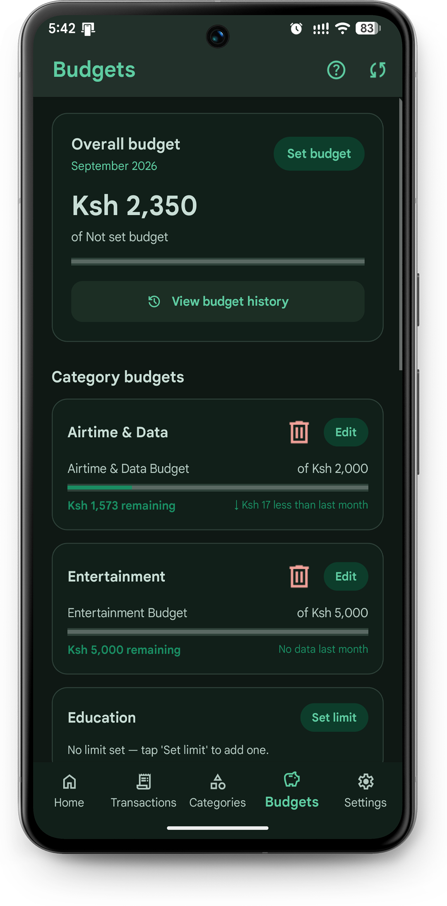
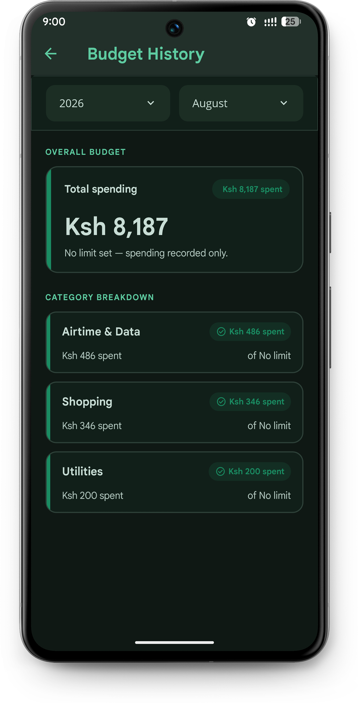
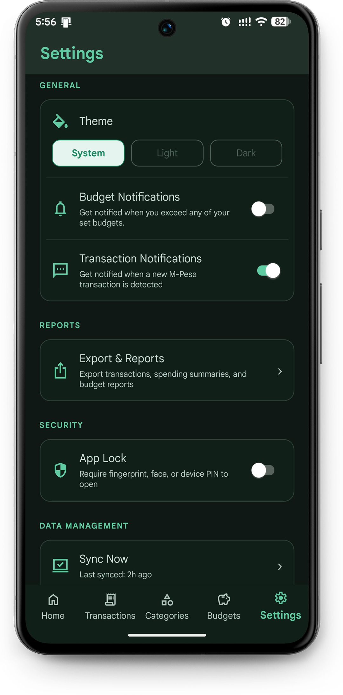
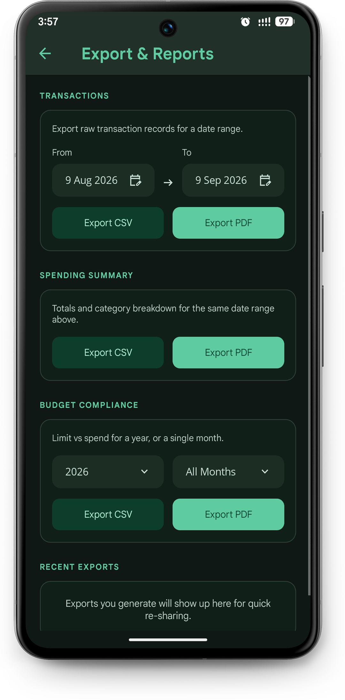

<p align="center">

</p>
<h1 align="center"> PesaScope </h1>

<p align="center">
  <a href="https://play.google.com/store/apps/details?id=com.bkokumu.pesascope">
    
  </a>
</p>

A personal Android app for automatically tracking M-Pesa transactions by parsing SMS messages directly on your device. No data leaves your phone.

## Demo

https://github.com/user-attachments/assets/85c0c283-994b-462f-83a7-e3c2c7b94f90

## Features

#### 1. Home

- View aggregated data in a weekly, monthly and yearly view
- View top categories(based on selected view) and recent transactions

<p align="center">
  
  
  
</p>

#### 2. Transactions

- View all transactions grouped per date
- Filter transactions based on duration, transaction type ,transaction category or search query

<p align="center">
  
</p>

### 3. Transaction detail

- View transaction details
- Change auto-assigned category of a transaction
- Attach a note to the transaction

<p align="center">
  
</p>

#### 4. Categories

- View spending breakdown on a monthly basis in a pie chart
- Filter, search and sort category items
- Filter and search rule items
- Create new category(user defined) and rule
- View transactions tied to a specific category by pressing '>' on a category item

<p align="center">
  
</p>

#### 5. Budget

- Assign an overall budget that tracks general spending on a monthly basis
- Assign a category budget that tracks category spending on a monthly basis

<p align="center">
  
</p>

#### 6. Budget History

- Meant to persist your budget compliance as those displayed on the Budget screen get reset every month
<p align="center">
  
</p>

#### 7. Settings

- Toggle app theme
- Toggle Budget and Transaction notifications
- Toggle biometrics requirement on app launch
- Sync data or delete all of it
- View app details and links

<p align="center">
  
</p>

#### 8. Export & reports

- Export transactions, budget compliance and categorized spending breakdown for a specified duration as pdf or csv
- View, reuse or clear recent exports

<p align="center">
  
</p>

## Build & Install

### Requirements

- .NET 10 SDK
- An Android device running API 29+ (Android 10 or newer)

#### 1. Clone

```bash
git clone https://github.com/KOKUMUbooker/pesa-scope.git
cd pesa-scope
```

#### 2. Restore

```bash
dotnet restore
```

#### 3. Build APK

```bash
cd PesaScope.App
```

```bash
dotnet publish -f net10.0-android -c Release -p:AndroidPackageFormat=apk
```

The signed APK will be at:
`PesaScope.App/bin/Release/net10.0-android/publish/com.bkokumu.pesascope-Signed.apk`

#### 4. Install on device

Transfer the APK to your Android device and open it to install. You may need to enable **Install from unknown sources** in your device settings if prompted.

### First-time Setup

https://github.com/user-attachments/assets/ba66af87-92ad-4db7-a404-32e308e71fe3

PesaScope requires SMS read permission to parse M-Pesa messages. Android classifies this as a **restricted permission** and blocks it for apps installed outside the Play Store. Follow these steps to grant it:

1. Open **Settings → Apps → PesaScope → App Info**
2. Tap the **⋮ (three-dot menu)** in the top-right corner
3. Select **Allow restricted settings**
4. Go back to PesaScope and proceed through onboarding — grant the SMS permission when prompted

### Onboarding overview

| Step                 | What happens                                                                                                              |
| -------------------- | ------------------------------------------------------------------------------------------------------------------------- |
| Grant SMS permission | A single permission grant enables both reading your existing M-Pesa history and capturing new transactions as they arrive |
| Import history       | PesaScope reads existing M-Pesa messages from your inbox and imports them automatically — no extra setup needed           |

> Both historical import and ongoing background capture work purely off the SMS read permission.

## Privacy

All processing happens locally on your device. PesaScope only reads messages from the `MPESA` sender. No data is transmitted or stored externally.
